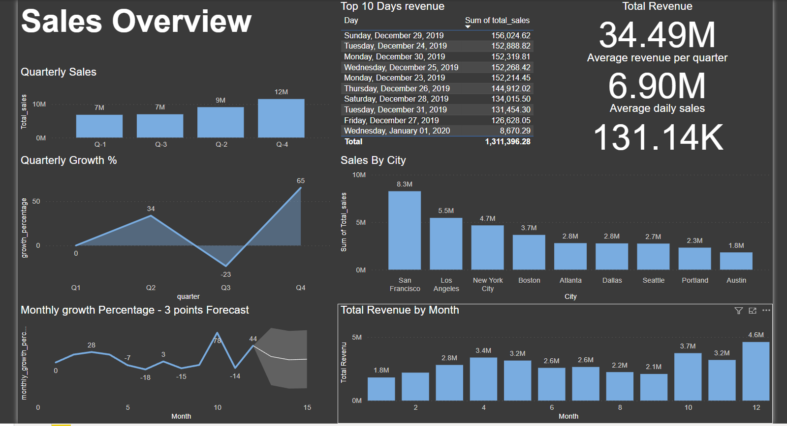
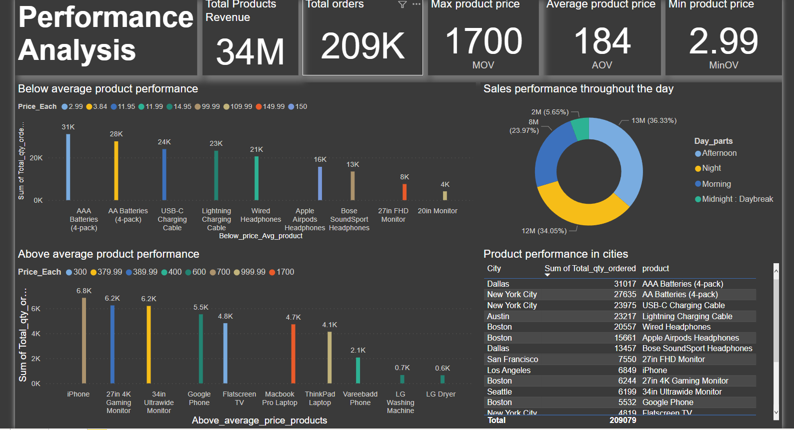

# Sales Analysis Project

## Overview
This project provides a comprehensive analysis of sales performance using SQL and Power BI. The analysis covers various aspects, including sales by city, product performance, revenue growth, and trends over time. The goal of this project is to derive actionable insights that can help drive business decisions and improve sales strategies.

## Tools Used
- **SQL:** Used for querying and extracting data from the sales database.
- **Power BI:** Utilized to create dynamic and interactive visualizations that present the data in a clear and insightful manner.

## Key Insights

1. ### Total Revenue
   - **Total Revenue:** **$34.49M**
   - **Average Revenue per Quarter:** **$6.90M**
   - **Average Daily Sales:** **$131.14K**

2. ### Quarterly Sales and Growth
   - **Quarterly Sales:** The highest sales were recorded in Q4, with a total of $12M, showing a significant growth of 65% from the previous quarter.
   - **Growth Trends:** There was a notable dip in Q3, with a negative growth of 23%, followed by a strong recovery in Q4.

3. ### Top Performing Cities
   - **San Francisco:** Led the sales by city with **$8.3M**, followed by Los Angeles (**$5.5M**) and New York City (**$4.7M**).

4. ### Product Performance
   - **Top Products:** Below-average products like AAA Batteries and USB-C Charging Cables showed strong sales volume, but higher-priced products like iPhones and 27in Monitors drove substantial revenue despite lower quantities sold.
   - **Sales Distribution:** A significant portion of sales occurred during the afternoon and night, suggesting a pattern in consumer buying behavior.

## Visualizations

### Sales Overview
- **Quarterly Sales:** Bar chart visualizing the total sales per quarter.
- **Top 10 Days Revenue:** Table listing the top 10 revenue-generating days.
- **Sales by City:** Bar chart displaying sales figures across major cities.
- **Monthly Growth Percentage:** Line chart with a 3-point forecast, analyzing growth trends.

### Performance Analysis
- **Below Average Product Performance:** Bar chart analyzing products with below-average prices and their sales volume.
- **Above Average Product Performance:** Bar chart highlighting products with above-average prices and their sales volume.
- **Sales Performance by Time of Day:** Pie chart depicting the distribution of sales across different times of the day.

## Instructions for Replication

1. **SQL Queries:** The SQL script `Sales project.sql` contains all the necessary queries to extract the data required for analysis.
2. **Power BI Dashboard:** The dashboard can be explored using the provided `.pbix` file (Power BI Desktop). Ensure you have Power BI installed to interact with the visualizations.

## Conclusion
This analysis offers valuable insights into sales performance across various dimensions. The data-driven approach highlights key areas for growth and optimization, providing a solid foundation for strategic decision-making.
